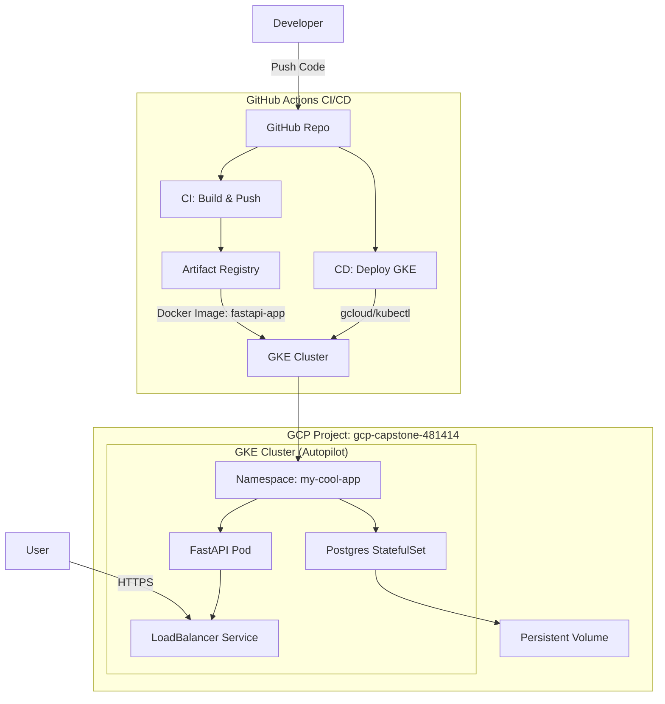
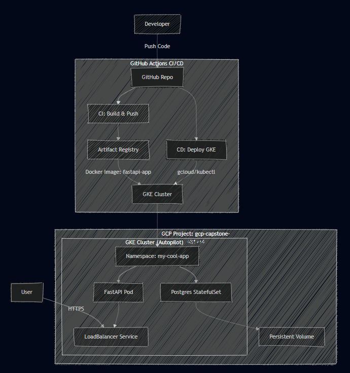

# GCP Architecture

The BookShelf application is deployed on Google Kubernetes Engine (GKE) using a CI/CD pipeline. The architecture follows a microservices pattern, separating the application logic from the data layer.

## Diagram

## Components

### 1. Source Control & CI/CD
*   **GitHub**: Hosts the application code and infrastructure definitions.
*   **GitHub Actions**:
    *   **CI Pipeline**: Builds the Docker image from the source code and pushes it to Google Artifact Registry.
    *   **CD Pipeline**: Handles promotion of images (tagging) and deployment to GKE using `kubectl`.

### 2. Artifact Registry
*   **Purpose**: Stores the Docker container images.
*   **Strategy**: Images are tagged with Git SHA for traceability and Semantic Versions (e.g., `v1.0.0`) for production releases.

### 3. Google Kubernetes Engine (GKE)
*   **Mode**: Autopilot. This removes the need to manage node VMs; Google automatically scales the infrastructure based on pod requirements.
*   **Namespace**: `my-cool-app`. Logical isolation within the cluster.

#### Workloads
1.  **FastAPI Deployment**:
    *   **Image**: `us-central1-docker.pkg.dev/gcp-capstone-481414/bookshelf-docker-repo/fastapi-app`
    *   **Replicas**: 1 (Configurable via HPA in the future).
    *   **Exposure**: External LoadBalancer.
2.  **PostgreSQL StatefulSet**:
    *   **Image**: `postgres:13`.
    *   **Storage**: Persistent Volume Claim (PVC) utilizing `standard-rwo` storage class.
    *   **Init**: A `ConfigMap` mounts an `init.sh` script to automatically create the database schema and table on first startup.

### 4. Networking
*   **LoadBalancer**: Exposes the FastAPI service to the public internet on port 80/443.
*   **ClusterIP**: Internal service for the database, allowing the FastAPI app to communicate with Postgres via the DNS name `db`.
